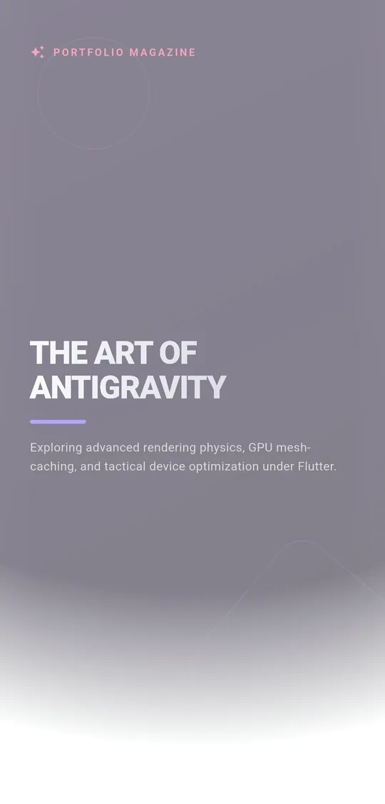
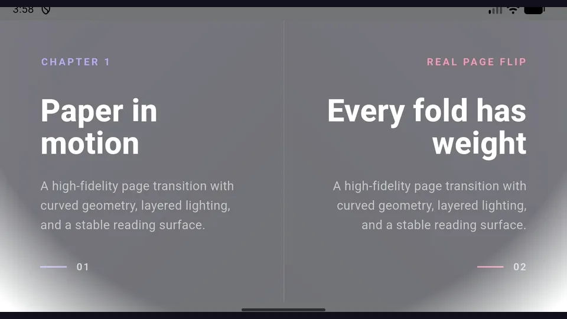

# Real Page Flip Engine for Flutter

[](https://pub.dev/packages/real_page_flip)
[](https://github.com/ChaPDCha/flutter_real_page_flip)
[](https://github.com/ChaPDCha/flutter_real_page_flip)
[](https://github.com/sponsors/ChaPDCha)
[](LICENSE)
[](https://chapdcha.github.io/flutter_real_page_flip/)
[](https://pub.dev/packages/real_page_flip)

A production-hardened page flip engine for Flutter. Single-page and double-spread.
Physics-based paper fold, adaptive haptics, sound, dark mode. Runs on Android, iOS,
Web (CanvasKit + WASM), Windows, macOS, and Linux — all 6 Flutter platforms.

## Built for RealBible. Running in Production.

Real Page Flip is the rendering engine behind two live Google Play apps:

- [**RealBible**](https://play.google.com/store/apps/details?id=com.jinproduction.realbible&pcampaignid=web_share)
- [**The King's Way (왕의 길)**](https://play.google.com/store/apps/details?id=kr.chapdcha.thekingsway&pcampaignid=web_share)

This is not a weekend prototype. It is the engine that thousands of readers use
every time they turn a page. Every edge case below was encountered on a real
device, reported by a real user, and fixed:

| Real-world issue | Resolved |
|------------------|----------|
| iPhone SE haptic motor buzz | Fixed |
| Dark-paper shadow blade artifacts | Fixed |
| Single-page flap splitting into stacked sheets | Fixed |
| Extreme vertical drag causing layer seams | Fixed |
| GPU memory leak from static shader cache | Fixed |

1,199 tests. 0 analyzer issues. Free (MIT) for any project, commercial or personal.

In 2026, any AI coding tool can generate a page-flip animation in minutes.
**This engine is different because it has already solved what a generated
prototype has not even encountered yet.**

English | [한국어](README_KR.md)

## Why This Engine (Not a Generated One)

| Vibe-coded prototype | Real Page Flip |
|----------------------|----------------|
| Works on the developer's phone | Verified on budget iPhone and Android |
| Looks correct at first glance | 1,199 tests catch edge cases you haven't seen |
| Fixed resolution only | Three adaptive performance profiles (low/medium/high) |
| Sterile visual output | Physics-modeled crease shadows, paper curl shading, dark-paper moonlight tones |
| No sensory feedback | Continuous haptic waveform pipeline + synchronized page-rustle audio |
| ~100 lines of demo code | 31 focused source files with documented architecture |

## Demos

### Live Web Preview

**[Try it in your browser →](https://chapdcha.github.io/flutter_real_page_flip/)**

Drag or tap the pages to feel the physics. Switch between single-page and
double-spread mode, tune sensitivity and paper opacity, or toggle haptics
(on a real device) — all from the in-app control deck.

### Mobile single-page view

Four slow page turns on a portrait mobile viewport using the high-quality rendering profile.



### 16:9 double-spread view

Four slow spread turns with distinct left- and right-page content, on a 16:9 landscape viewport.



## Technical Foundation

### Hybrid Snapshot Engine
During a flip, the renderer works from flattened page textures instead of
repainting the full widget tree every frame. Actual frame rate depends on page
capture cost, device, and host layout.

### Intelligent Memory Windowing
Retained page state is bounded around the active page window. Whether your book
has 10 pages or 10,000, memory footprint stays constant.

### Lightweight Geometry Engine
Curved clips, dynamic shadows, and highlights are calculated with a custom
math-based Path Clipping engine — no heavy 3D perspective transforms.

### Production-Hardened Layouts
Internal constraint gate prevents "unbounded height" errors in common `Stack`,
`Column`, and `Scaffold` compositions.

---

## Sensory Experience

- **Sound**: High-quality page-rustle audio that varies naturally with gesture speed.
- **Haptics**: Perceptual gain pipeline with adaptive quality routing. Continuous
  waveform texture on premium devices, discrete confirmation on basic motors.

## Installation

```bash
flutter pub add real_page_flip
```

## Quick Start

```dart
import 'package:real_page_flip/real_page_flip.dart';

PageFlipWidget(
  itemCount: 10,
  itemBuilder: (context, index) => MyPage(index),
)
```

## Single-page settle policy

Controls whether the moving back face eases into the destination near the end of
a single-page turn. Disable for a stable back face until the page commits:

```dart
PageFlipWidget(
  config: const PageFlipConfig(
    enableSinglePageSettleReveal: false,
  ),
  itemCount: 10,
  itemBuilder: (context, index) => MyPage(index),
)
```

Double-spread mode always maps the physical verso and ignores this setting.

## Snapshot refresh and thermal budget

For long, scrollable, or provider-heavy pages, use dirty-aware refreshing:

```dart
final flipController = PageFlipController();

PageFlipWidget(
  controller: flipController,
  contentRevision: documentRevision,
  config: const PageFlipConfig(
    snapshotRefreshPolicy: PageFlipSnapshotRefreshPolicy.whenDirty,
    maxSnapshotPixelRatio: 2.25,
  ),
  itemCount: pages.length,
  itemBuilder: (context, index) => pages[index],
)

flipController.markPageDirty(changedPageIndex);
flipController.markCurrentPageDirty(prewarm: false);
```

`whenDirty` observes scrolling and pre-captures after scroll end. Use
`contentRevision` for declarative refresh, or `markPageDirty()` for one page.
`maxSnapshotPixelRatio` caps only the moving raster texture; settled content
remains at native resolution.

## Flip Sensitivity

Independent forward/backward drag thresholds and gesture sensitivity:

```dart
PageFlipWidget(
  config: PageFlipConfig(
    cutoffForward: 0.35,
    cutoffPrevious: 0.5,
    sensitivity: 0.5,
  ),
  itemCount: 10,
  itemBuilder: (context, index) => MyPage(index),
)
```

## Double-spread (two-page) mode

```dart
PageFlipWidget(
  spreadMode: PageFlipSpreadMode.doubleSpread,
  itemCount: spreadCount,
  config: PageFlipConfig(
    flapBackStrength: 0.0, // mirrored back text disabled by default
  ),
  itemBuilder: (context, spreadIndex) => MyTwoPageSpread(spreadIndex),
)
```

| Responsibility | Detail |
|----------------|--------|
| `itemBuilder` | Each index renders a full-width spread (left + right pages). |
| `itemCount` | Number of spreads (e.g. `ceil(pageCount / 2)`). |
| Spine reveal | Forward reveals the left half of the next spread; backward the right half of the previous. |

## Dark Mode

Theme-aware by default. Shadows, highlights, and edge masks adapt automatically
based on background luminance. Zero config:

```dart
MaterialApp(
  theme: ThemeData.light(),
  darkTheme: ThemeData.dark(),
  themeMode: ThemeMode.system,
  home: Scaffold(
    body: PageFlipWidget(
      itemCount: pages.length,
      itemBuilder: (context, index) => MyPage(index),
    ),
  ),
)
```

## Performance Benchmark

```bash
cd example
flutter run --profile -t lib/performance_benchmark.dart \
  --dart-define=PERFORMANCE_PROFILE=medium \
  --dart-define=FLIPS=80
```

Logs completed flips, request-to-page-change latency, build/raster averages,
P90/P99, max frame time, and jank count from `FrameTiming`.

## Support the Project

Real Page Flip is free (MIT) and always will be. Maintaining a production-grade
engine — running 1,199 tests, verifying fixes across real devices, and keeping
pace with Flutter releases — requires sustained investment.

[Sponsor on GitHub →](https://github.com/sponsors/ChaPDCha)

For companies, sponsorship tiers include having your name or logo listed here.

## License

MIT — free for any project, commercial or personal. See [LICENSE](LICENSE).

Built by [ChaPDCha](https://github.com/ChaPDCha)
