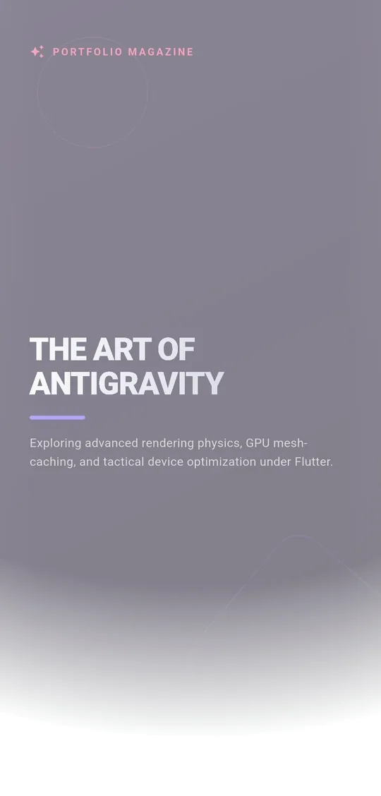
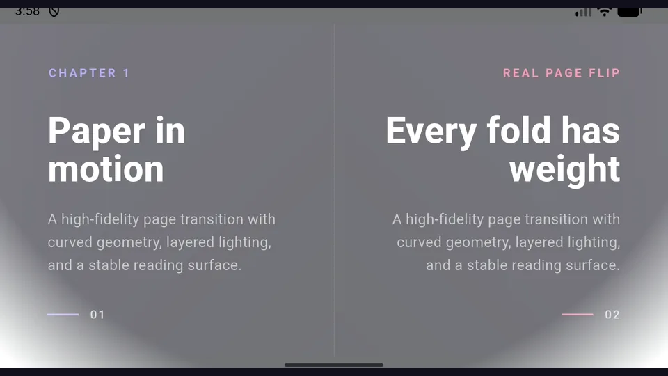

# Flutter 실시간 페이지 플립 엔진 (Real Page Flip)

[](https://pub.dev/packages/real_page_flip)
[](LICENSE_KR)
[](https://flutter.dev)

플러터를 위한 고성능 3D 스타일 페이지 플립 엔진입니다. 제한된 스냅샷
윈도우와 렌더링 프로필을 통해 다양한 성능의 기기에서 사용할 수 있도록
설계되었습니다. 실제 프레임 속도는 페이지 캡처 비용과 호스트 UI에 따라 달라집니다.

> **안내**: 세로형 단일 페이지 레이아웃과 태블릿 및 넓은 화면을 위한 **가로형 2단 보기(양쪽 페이지 스프레드 모드)**를 지원합니다.

## 데모 시연

### 모바일 1면 보기

세로 모바일 화면과 최고 품질 렌더링 프로필에서 4페이지를 천천히 넘긴 영상입니다.



### 16:9 2면 보기

좌우 페이지에 서로 다른 콘텐츠를 배치하고, 16:9 가로 화면과 최고 품질 렌더링 프로필에서 4개 스프레드를 천천히 넘긴 영상입니다.



기존의 페이지 플립 라이브러리들은 UI가 복잡해질수록 성능 저하가 발생하기 쉽습니다. Real Page Flip은 근본적으로 다른 접근 방식을 취합니다:

### 1. 하이브리드 스냅샷 엔진 (GPU 부하 최소화)
무거운 애니메이션 중에 매 프레임 위젯 트리를 다시 그리는 방식이 아닙니다. 우리 엔진은 페이지의 고해상도 **스냅샷을 캡처(Flattening)**하여 처리합니다.
- **장점**: 애니메이션 중에는 전체 호스트 위젯 트리를 매 프레임 다시 그리지 않고 캡처된 페이지 텍스처를 사용합니다.

### 2. 지능형 메모리 윈도잉 (Intelligent Windowing)
책이 10장이든 10,000장이든 메모리 점유율은 일정하게 유지됩니다.
- **장점**: 현재 페이지와 탐색에 필요한 인접 페이지 중심으로 상태를 제한하여 전체 페이지를 동시에 유지하지 않습니다.

### 3. 경량 지오메트리 엔진
오래된 하드웨어에서 떨림 현상을 유발할 수 있는 무거운 3D 변환 대신, 정교한 **수학적 경로 클리핑(Path Clipping) 엔진**을 사용합니다.
- **장점**: 전체 3D 장면 없이 곡선 클리핑, 동적 그림자, 빛 반사 효과를 계산합니다.

### 4. 프로덕션 수준의 레이아웃 안정성 (Single Constraint Gate)
"Vertical viewport was given unbounded height" 같은 레이아웃 에러로 고생할 필요가 없습니다.
- **장점**: 내부의 '제약 게이트' 구조가 부모 위젯(Stack, Column, Scaffold 등)이 무엇이든 상관없이 안정적으로 크기를 조정하고 렌더링합니다.

---

## 감각적인 경험: 사운드와 진동

오감을 자극하는 피드백으로 완성도를 높였습니다:
- **실감 나는 사운드**: 드래그 속도에 따라 자연스럽게 변화하는 고품질 종이 질감 사운드.
- **정밀한 햅틱**: 종이의 마찰력과 마지막에 붙는 느낌을 손끝으로 전달합니다.

## 설치 방법

`pubspec.yaml`에 `real_page_flip`을 추가하세요:

```bash
flutter pub add real_page_flip
```

기본 햅틱 모드는 기기 능력에 따라 자동 조정됩니다. 고급 기기는 연속 종이
질감과 네이티브 프리미티브를 사용하고, 기본형 진동 모터는 페이지 확정 시점의
짧은 피드백만 사용합니다. 완전 무진동은 `PaperTexturePreset.none`으로 설정합니다.

```dart
PageFlipConfig(
  hapticQuality: HapticQuality.adaptive, // 권장 기본값
  hapticTexturePreset: PaperTexturePreset.textured,
)
```

## 라이선스

이 프로젝트는 **MIT 라이선스**를 따릅니다. 자세한 내용은 [LICENSE](LICENSE) 및 [LICENSE_KR](LICENSE_KR) 파일을 참고해 주세요. 비상업적 목적뿐만 아니라 상업적 프로젝트에서도 제한 없이 완전 무료로 사용하실 수 있습니다.

---

Built by [ChaPDCha](https://github.com/ChaPDCha)
