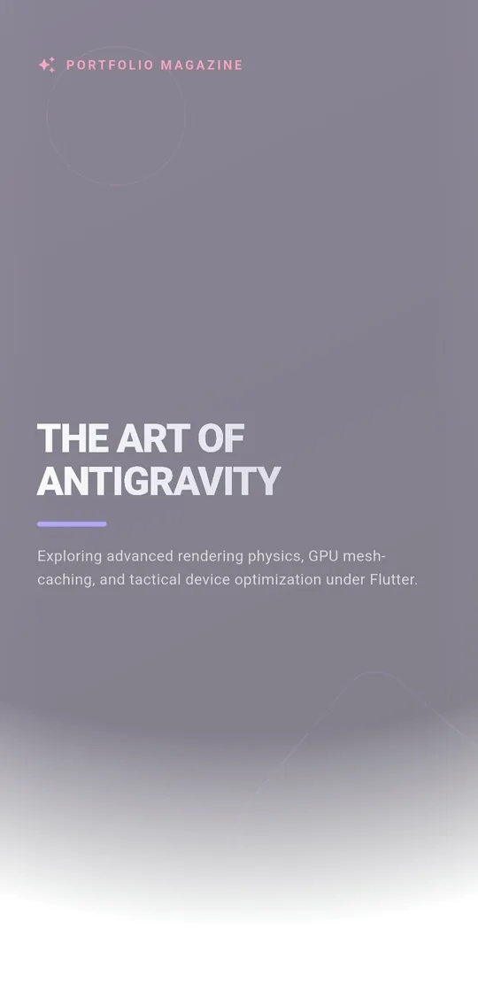
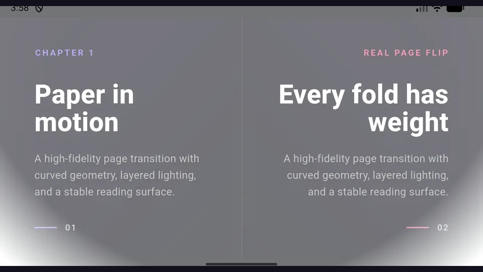

# Flutter 실시간 페이지 플립 엔진 (Real Page Flip)

[](https://pub.dev/packages/real_page_flip)
[](https://github.com/ChaPDCha/flutter_real_page_flip)
[](https://github.com/ChaPDCha/flutter_real_page_flip)
[](https://github.com/sponsors/ChaPDCha)
[](LICENSE)
[](https://chapdcha.github.io/flutter_real_page_flip/)
[](https://pub.dev/packages/real_page_flip)

실제 서비스에서 검증된 Flutter 페이지 플립 엔진입니다. 단면 보기와 양면 보기를
모두 지원하며, 물리 기반 종이 접힘, 적응형 햅틱, 사운드, 다크 모드를 제공합니다.
Android, iOS, Web (CanvasKit + WASM), Windows, macOS, Linux — Flutter 6개 플랫폼
전부에서 저사양 기기까지 끊김 없이 작동합니다.

## RealBible를 위해 개발되어, 실제 서비스에서 검증됨

Real Page Flip은 현재 Google Play에 출시된 두 개의 앱에서 사용되고 있습니다:

- [**RealBible (리얼바이블)**](https://play.google.com/store/apps/details?id=com.jinproduction.realbible&pcampaignid=web_share)
- [**왕의 길 (The King's Way)**](https://play.google.com/store/apps/details?id=kr.chapdcha.thekingsway&pcampaignid=web_share)

이 엔진은 주말 프로토타입이 아닙니다. 수천 명의 독자가 페이지를 넘길 때마다
사용하는 렌더링 엔진입니다. 아래 모든 엣지 케이스는 실제 기기에서 실제 사용자가
발견하고 수정된 항목들입니다:

| 실제 발생 문제 | 해결 |
|--------------|------|
| iPhone SE 진동 모터 버즈 노이즈 | 수정 완료 |
| 다크 모드에서 그림자 칼날 현상 | 수정 완료 |
| 단면 넘김에서 3겹으로 갈라지는 레이어 | 수정 완료 |
| 극단적 수직 드래그 시 레이어 경계 불일치 | 수정 완료 |
| 정적 셰이더 캐시로 인한 GPU 메모리 누수 | 수정 완료 |

1,400개 이상의 테스트. 분석기 0 이슈. MIT 라이선스로 상업적/비상업적 모든 프로젝트에서 무료.

**이 엔진은 수천 번의 실제 페이지 넘김에서만 드러나는 엣지 케이스를
이미 해결했다는 점에서 다릅니다.**

[English](README.md) | 한국어

## 이 엔진의 차별점

- **실제 기기 검증**: 저가형 iPhone SE와 보급형 Android 기기에서 테스트 — 아래 모든 버그는 실제 사용자가 신고하고 수정한 항목입니다.
- **1,400개 이상의 테스트, 0 analyzer 이슈**: 제스처 중재, 기하학 불변속성, 메모리 생명주기, 접근성, 스트레스 시나리오까지 포괄.
- **조절 가능한 성능**: 저/중/고 세 가지 렌더링 프로필로 품질과 속도를 맞바꿉니다. 기기 등급에 맞게 직접 고르세요(기본값: 중).
- **물리 기반 비주얼**: 실제 종이 동작에서 유도된 접힘 그림자, 종이 컬 셰이딩, 다크 페이퍼 문라이트 톤.
- **완전한 감각 피드백**: 속도에 따라 변화하는 페이지 넘김 사운드와 연속 햅틱 파형 파이프라인이 동기화됩니다.
- **프로덕션 아키텍처**: 문서화된 구조의 작고 집중된 소스 파일.

## 데모

### 라이브 웹 미리보기

**[브라우저에서 직접 체험하기 →](https://chapdcha.github.io/flutter_real_page_flip/)**

페이지를 드래그하거나 탭하여 물리 엔진을 직접 느껴보세요. 단면/양면 보기 전환,
민감도 및 종이 불투명도 조절, 햅틱 토글(실제 기기에서)까지 인앱 컨트롤 덱에서
모두 조작할 수 있습니다.

### 모바일 1면 보기



### 16:9 2면 보기



## 기술 기반

- **하이브리드 스냅샷 엔진**: 애니메이션 중에는 위젯 트리를 매 프레임 다시
  그리지 않고, 캡처된 페이지 텍스처로 렌더링합니다.
- **지능형 메모리 윈도우**: 10페이지든 10,000페이지든 메모리 점유율은 활성
  페이지 주변으로 제한됩니다.
- **경량 지오메트리 엔진**: 무거운 3D 변환 없이, 수학 기반 Path Clipping
  엔진으로 곡선 클리핑, 동적 그림자, 반사 효과를 계산합니다.
- **프로덕션 레이아웃 안정성**: 내부 제약 게이트가 `Stack`, `Column`,
  `Scaffold` 등 어떤 부모 위젯에서도 안정적인 크기를 보장합니다.

## 감각 경험

- **사운드**: 드래그 속도에 따라 자연스럽게 변화하는 고품질 페이지 넘김음.
- **햅틱**: 기기 성능에 따라 자동 조정되는 햅틱 품질 라우팅. 프리미엄 기기는
  연속 파형 텍스처, 기본 모터는 개별 확인 피드백.

## 설치

```bash
flutter pub add real_page_flip
```

Flutter 3.44 이상이 필요합니다.

## 플랫폼 지원

| 플랫폼 | 페이지 넘김·제스처 | 햅틱 | 기본 페이지 넘김 소리 |
|--------|--------------------|------|------------------------|
| Android | 지원 | 네이티브 진동 (모터가 지원하면 진폭·컴포지션 효과) | 지원 (`SoundPool`) |
| iOS | 지원 | 네이티브 Core Haptics, 실패 시 UIKit 피드백 | 지원 (`AVAudioPlayer`) |
| Web (CanvasKit + WASM) | 지원 | 브라우저가 진동을 지원하면 Flutter `HapticFeedback` | 지원 (`HTMLAudioElement`) |
| Windows, macOS, Linux | 지원 (순수 Dart, 네이티브 코드 없음) | 없음 (Flutter `HapticFeedback`으로 폴백) | 없음 — `PageFlipSoundPlayer`를 직접 전달 |

## 빠른 시작

```dart
import 'package:real_page_flip/real_page_flip.dart';

PageFlipWidget(
  itemCount: 10,
  itemBuilder: (context, index) => MyPage(index),
)
```

## 단면 보기 정착 텍스처 정책

단면 모드에서 페이지가 완료되기 직전 뒷면을 목적지에 맞춰 완화할지 제어합니다:

```dart
PageFlipWidget(
  config: const PageFlipConfig(
    enableSinglePageSettleReveal: false,
  ),
  itemCount: 10,
  itemBuilder: (context, index) => MyPage(index),
)
```

## 스냅샷 갱신

길고 스크롤이 있는 페이지나 Provider 구독이 많은 페이지에서 dirty 기반 갱신 사용:

```dart
final flipController = PageFlipController();

PageFlipWidget(
  controller: flipController,
  contentRevision: documentRevision,
  config: const PageFlipConfig(
    snapshotRefreshPolicy: PageFlipSnapshotRefreshPolicy.whenDirty,
    maxSnapshotPixelRatio: 2.25,
  ),
  itemCount: pages.length,
  itemBuilder: (context, index) => pages[index],
)

flipController.markPageDirty(changedPageIndex);
```

## 사운드 커스터마이즈

엔진에는 기본 페이지 넘김음 하나가 들어 있습니다. 사운드는 부가 기능이라
햅틱은 그대로 두고 사운드만 교체할 수 있습니다.

```dart
// 기본 플레이어에 앱의 음원만 교체 (pubspec에 asset 선언 필요)
PageFlipConfig(soundPlayer: DefaultPageFlipSound(asset: 'assets/sounds/flip.mp3'))

// 또는 원하는 오디오 백엔드로 직접 구현
class MyFlipSound implements PageFlipSoundPlayer {
  @override
  Future<void> warmUp() async {/* 미리 로드 */}

  @override
  Future<void> play({required double volume}) async {/* 재생 */}

  @override
  void dispose() {}
}
```

- `volume`은 넘기는 속도에 따라 조절된 `0.0..1.0` 권장값입니다.
- `enableSound: false`면 어떤 플레이어도 로드·재생하지 않습니다.
- 직접 넘긴 플레이어의 dispose는 앱이 책임집니다. 엔진은 dispose하지 않습니다.
- 기본 플레이어는 처음 쓸 때 로드됩니다. 사운드를 끄거나 커스텀 플레이어를
  쓰면 오디오 기능을 아예 건드리지 않습니다.
- 기본 음향은 이 패키지의 자체 플러그인으로 **Android, iOS, 웹**에서
  재생됩니다(외부 오디오 의존성 없음). **데스크톱에는 기본 음향이 없습니다.**
  필요하면 `audioplayers` 등으로 `PageFlipSoundPlayer`를 직접 구현해 넘기세요
  (예제는 영문 README의 Custom sound 참고).

## 다크 모드

배경 휘도에 따라 그림자, 하이라이트, 엣지 마스크가 자동으로 조정됩니다.
별도 설정 불필요:

```dart
MaterialApp(
  theme: ThemeData.light(),
  darkTheme: ThemeData.dark(),
  themeMode: ThemeMode.system,
  home: Scaffold(
    body: PageFlipWidget(
      itemCount: pages.length,
      itemBuilder: (context, index) => MyPage(index),
    ),
  ),
)
```

## 접근성과 입력

- **동작 줄이기**: 기기의 "동작 줄이기" 설정(iOS 동작 줄이기, Android "애니메이션
  제거", 브라우저의 `prefers-reduced-motion`)이 켜져 있으면 가장자리 탭,
  `nextPage`, `previousPage`는 애니메이션 없이 바로 넘어가고, 손가락을 뗀 드래그는
  곧바로 목적지에 붙습니다. 드래그하는 동안에는 손가락을 따라 그대로 움직입니다.
  항상 애니메이션을 쓰려면 `PageFlipConfig(respectReducedMotion: false)`.
- **화면 읽기 프로그램**: "페이지 N / M"을 안내하고 증가·감소·스크롤 동작을
  지원합니다. 문구는 `semanticBuilder`로 바꿀 수 있습니다.
- **키보드** (선택): `PageFlipConfig(enableKeyboardNavigation: true)` — 오른쪽/왼쪽
  화살표, Page Down/Up, Space(Shift+Space는 이전 페이지), Home과 End(처음/마지막).
- **마우스 휠·트랙패드** (선택): `PageFlipConfig(enableWheelNavigation: true)` —
  스크롤 한 번에 한 페이지. 스크롤되는 페이지는 끝에 닿기 전까지 휠을 그대로 씁니다.

아직 지원하지 않는 것: 오른쪽→왼쪽 읽기 방향. 엔진은 항상 왼쪽→오른쪽 책처럼
넘깁니다.

## 2면 보기 (Double-Spread)

```dart
PageFlipWidget(
  spreadMode: PageFlipSpreadMode.doubleSpread,
  itemCount: spreadCount,
  itemBuilder: (context, spreadIndex) => MyTwoPageSpread(spreadIndex),
)
```

## 폴더블, 듀얼 스크린, 창 크기 변경

엔진은 주어진 영역을 채우고 어떤 모양에도 맞춰지므로 폴더블 전용 설정이
필요 없습니다. 접기·펴기·회전·분할 화면은 모두 그 영역의 모양이 바뀌는 일일
뿐입니다. 모양이 한 번에 약 10% 넘게 바뀌면 300ms를 기다리지 않고 페이지 스냅샷을 바로
다시 찍습니다. 기기에서는 이 촬영에 GPU 읽기 시간이 들기 때문에, 촬영이 끝나기
전에 시작된 넘김은 시작하는 순간 필요한 쪽을 그 자리에서 다시 찍습니다. 그래서
접기·펴기·회전 뒤에 시작한 넘김은 옛 비율로 그려지지 않습니다. 남은 한계는 두
가지입니다. 모양이 바뀌는 순간 이미 넘어가던 책장은 끝날 때까지 옛 사진을 쓰고,
창을 끌어 조금씩 바꾸면 디바운스가 끝날 때까지 몇 퍼센트 어긋날 수 있습니다.
테스트는 갤럭시 Z 폴드8과 폴드8 울트라의 화면 모양(아이폰 듀오는 비율을 애플이
밝히지 않아 4:3과 3:4 모양으로 대신)으로, GPU 읽기가 여러 프레임 걸리는 경우까지
포함해 접기·펴기·회전을 한 장 보기와 두 장 보기 모두에서 재현합니다. 실기기에서는
실행해 보지 못했습니다.

**한 장 보기와 두 장 보기는 앱이 정합니다.** 엔진이 스스로 바꾸지 않습니다.
창 모양으로 정하는 규칙은 모든 플랫폼에서 동작하며, 책처럼 펼치는 폴드8(가운데가
접히는 4:3 안쪽 화면)은 두 장 보기와 잘 맞고 아이폰 듀오도 같은 책 형태입니다.
모드를 바꿀 때는 읽던 쪽을 이어 주세요(한 장 보기 `page` → 두 장 보기
`page ~/ 2`, 반대로는 `index * 2`). 모드를 바꾸는 순간 책장이 넘어가는 중이면 그
넘김은 취소되고(`onFlipEnd` 한 번, `onPageChanged` 없음) 넘겨 준 `initialIndex`로
이동합니다. 예제 코드는 영문 README를 참고하세요.

**접힘선과 힌지.** 두 장 보기에서 책등은 위젯의 가운데이고, 책이 화면을
채우면 이 기기들의 접힘선과 겹칩니다. 엔진은 `MediaQuery.displayFeatures`를
읽지 않으며, 플러터는 이 목록을 **Android에서만** 채웁니다. 따라서 아이폰 듀오는
창 모양으로 판단하세요. 힌지가 화면 일부를 가리는 기기(듀얼 스크린)에서는
펼침면 안쪽에 여백을 두거나 `DisplayFeatureSubScreen`으로 한쪽 화면에만
배치하세요.

**Android 매니페스트.** 액티비티의 `android:configChanges`에
`orientation|screenSize|smallestScreenSize|screenLayout|density`를 유지하세요
(플러터 기본 템플릿에 들어 있습니다). 빠지면 접을 때마다 액티비티가 다시 만들어져
읽던 위치를 앱이 복원해야 합니다.

## 성능 벤치마크

```bash
cd example
flutter run --profile -t lib/performance_benchmark.dart \
  --dart-define=PERFORMANCE_PROFILE=medium \
  --dart-define=FLIPS=80
```

실제 기기에서 80회 연속 페이지 넘김을 실행하고 다음을 측정합니다:

| 측정 항목 | 목표 |
|-----------|------|
| Build time (평균) | < 6 ms |
| Raster time (평균) | < 5 ms |
| P90 프레임 시간 | < 10 ms |
| P99 프레임 시간 | < 12 ms |
| 최대 프레임 시간 | < 18 ms |
| Jank 횟수 (80회) | 0 |

저/중/고 프로필에서 각각 실행하여 대상 기기 티어를 검증하세요. 스냅샷 캡처,
지오메트리 연산, 셰이더 성능의 회귀를 사용자 도달 전에 감지할 수 있습니다.

## 프로젝트 후원

Real Page Flip은 MIT 라이선스로 영원히 무료입니다. 그러나 프로덕션급 엔진 유지 —
1,400개 이상의 테스트 실행, 실제 기기 검증, Flutter 업데이트 대응 — 에는 지속적인
투자가 필요합니다.

[GitHub Sponsors에서 후원하기 →](https://github.com/sponsors/ChaPDCha)

기업 후원자는 README에 회사명 또는 로고를 노출하는 맞춤형 리워드를 선택할 수
있습니다.

## 라이선스

MIT — 상업적/비상업적 모든 프로젝트에서 무료. [LICENSE](LICENSE) 참조.

Built by [ChaPDCha](https://github.com/ChaPDCha)
